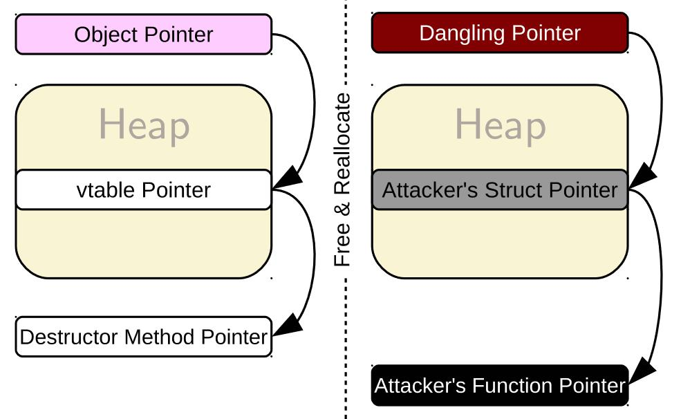

本文在新兴的CHERI体系结构扩展上，以低开销实现内存时间安全。

[CHERIvoke: Characterising Pointer Revocation using CHERI Capabilities for Temporal Memory Safety](https://www.cl.cam.ac.uk/~tmj32/papers/docs/xia19-micro.pdf) ([Poster](https://www.cl.cam.ac.uk/~sa614/posters/cherivoke.pdf))

## 背景

### 1. 时间安全漏洞

内存块被释放后，其对应的指针没有被设置为NULL，这个指针就被悬空了，形成了悬空指针（Dangling Pointer）。在它下一次使用之前，有其它代码对这块内存行了修改，那么当程序再次使用这块内存时，就很有可能会出现安全性问题。

为了避免出现悬空指针，需要在释放内存时将指针置为NULL。访问指针变量前，先判断是否为NULL，可以避免出现上述安全漏洞。但是当多个指针指向同一个内存块，就需要将所有指针变量的值都置为NULL。这就需要维护相应的元数据，开销会非常大。

### 2. [CHERI](https://murdoch.is/papers/cl14cheriisa.pdf) (Capability Hardware Enhanced RISC Instructions)

一种新的体系结构扩展，其中指针被扩展为原来的两倍大小(称为Capability)，扩展部分用于记录引用地址范围及权限等。

## 设计

关键：延迟所释放内存的重分配，直到完全清理其引用。

使用额外的隔离缓冲区用于缓存被释放的内存地址，使用影子映射表示堆内存(64位机器中，每1bit表示128位)。清理过程中扫描堆内存，检查其中指向隔离缓冲区的指针(通过影子映射)并置零。

硬件优化：CloadTags新指令、页表PTE CapDirty位。